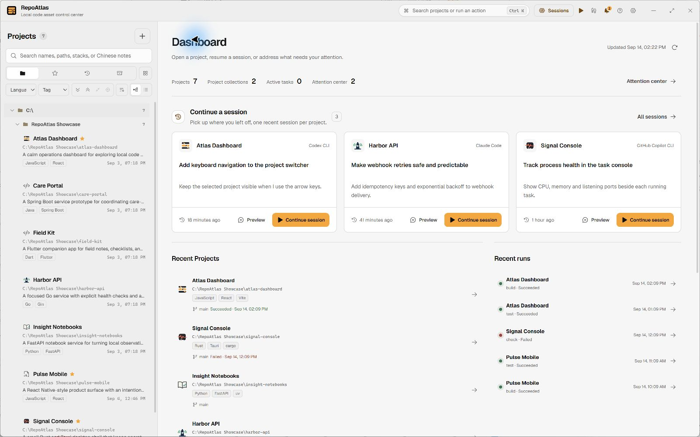
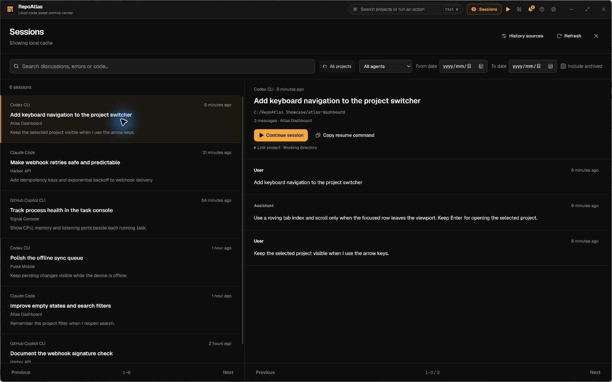
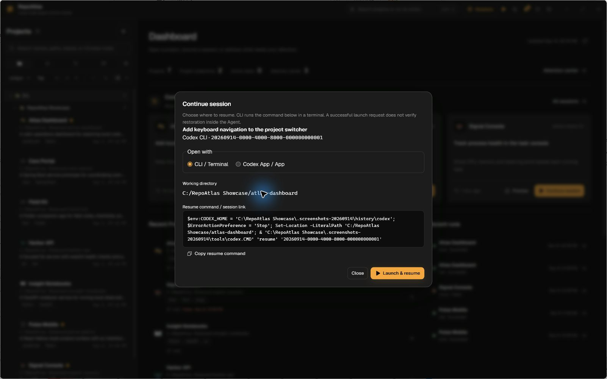

<p align="center">
  
</p>

<h1 align="center">RepoAtlas</h1>

<p align="center">
  <a href="README.zh-CN.md">简体中文</a>
</p>

<p align="center">
  <a href="https://github.com/Wujerry/RepoAtlas/actions/workflows/ci.yml"></a>
  <a href="LICENSE"></a>
</p>

RepoAtlas turns scattered local checkouts into one working library. See what each Project is, open it in the right coding Agent or tool, run repeatable development tasks, and keep the output and history on your machine.

> **macOS contributors wanted.** RepoAtlas has not yet been tested on real Mac hardware, so there is no supported macOS build today. If you have a Mac, help us build, test, and document it through [CONTRIBUTING.md](CONTRIBUTING.md), or open an [issue](https://github.com/Wujerry/RepoAtlas/issues) with reproducible results.

> **0.1.5 downloads:** Windows installers are labeled **UNSIGNED** and do not have an Authenticode signature. macOS packages are experimental, ad-hoc signed and not notarized. SmartScreen or Gatekeeper may show a warning. Updater payloads remain signed; release assets include SHA256SUMS.

<picture>
  <source media="(prefers-color-scheme: dark)" srcset="assets/screenshots/en-dark-workspace.jpg" />
  
</picture>

Desktop screenshots use fictional demonstration data.

## Let your AI Agent do the setup

The fastest first run is not filling in a project catalog by hand:

1. Open RepoAtlas and copy the onboarding instruction to your external AI coding Agent.
2. The Agent connects RepoAtlas MCP, asks which directories it may scan, and registers the approved Projects.
3. Using evidence from each checkout, the Agent adds useful descriptions, reusable Task Definitions, and recognizable Project icons.
4. RepoAtlas refreshes the local library so you can review the result and start working.

For a single open checkout, the Agent can call `register_project`. For a larger archive, the Agent asks for your approval, adds the approved directory as a **Scan Root**, and explicitly calls `scan_root`. Manual registration and scanning remain available in the desktop app.

The Agent keeps ownership of its model, account, provider configuration, conversation, and decisions about reading project files. RepoAtlas keeps the durable Project and task records.

Agent changes to the shared library continue to appear after onboarding, including edits to existing descriptions, tasks, and Collections. The desktop checks local database changes while visible and when you return to it; this does not scan project directories. Task requests expire after 15 minutes and must be requested again if they were not approved in time.

## Main features

- **Home workspace** — open recent Projects, continue coding sessions, review recent runs and handle items that need attention.
- **Sessions** — search authorized history across eight coding Agents, preview messages and resume a selected session in its original Agent.
- **Agent-assisted initialization** — let an external AI Agent inventory approved directories and write evidence-backed descriptions, tasks, and icons through MCP.
- **Project library** — search Projects in English or Chinese, group related work with Project Collections, and relate multiple checkouts through Repository Lineage.
  Rename Projects from their title without changing directories. Create Collections with searchable membership, selected-only review, and keyboard selection; an empty Collection can be filled later.
- **Project Brief and read-only Files** — inspect detected facts, environment requirements, README, source, configuration, recent activity, and run history without turning RepoAtlas into an editor.
  Environment files appear once with their evidence categories. Open a file in an expandable, syntax-highlighted preview with line numbers, content/path copy, and external-open actions.
- **Saved development tasks** — keep dev, test, build, and packaging commands as reviewed programs plus argument vectors, then run them in a real PTY.
- **Global task workbench** — follow active work across Projects in one full-window surface with up to four live terminals.
- **Runtime visibility** — see process-tree CPU, memory, child processes, listening ports, and safe localhost previews next to the terminal.
- **Conservative Git** — review status, diffs, and history; pull fast-forward only. SVN support remains read-only.
- **Attention and approval** — collect failed runs, unavailable Projects, environment mismatches, and Agent task requests that still need desktop approval.
- **Signed updates** — when a signed update is found, a title-bar entry opens a panel with the release notes and manual check, download, install, and restart actions. Checks are non-blocking and never touch the local library.
- **Local-first records** — Project metadata, task output, exit codes, logs, and audit history stay in local SQLite; no RepoAtlas account or sync server is required.


## Sessions & Continue Coding



Find a previous coding conversation across Agents and continue the selected session in its original Agent. Open **Sessions** from the title bar or command palette, or use **Continue session** on the home workspace and Project Overview.

1. **Authorize sources.** Review each absolute history directory, or use **Authorize all** to confirm the listed sources together. Authorization enables local indexing and read-only history access for connected MCP clients.
2. **Search and preview.** Search across Agents, filter by Project, Agent, date or archive status, and read matching messages before launching anything.
3. **Continue the selected session.** Review its command and working directory, then choose CLI or a supported App entry. Project icons identify recent work; clicking a Project title opens that Project.

Built-in history adapters cover **Claude Code, Codex CLI, OpenCode, Cursor CLI, Gemini CLI, GitHub Copilot CLI, Kimi Code, and Qwen Code**. Cursor IDE and Kimi Desktop histories are separate from their CLI histories and are not indexed by these adapters.

History stays local. Refresh shows cached results first and supports cancellation; revoking a source removes its index and excerpts without changing the Agent's original files. Restored backups require source authorization again.

Resume requires an installed Agent, an available session and a valid working directory. RepoAtlas checks the source and CLI before dispatch, reports errors, and lets you copy the command. Codex App uses a session deep link; App entries without a supported resume interface remain unavailable. The Agent owns login, model access and the actual conversation. Sessions are not migrated between Agents.

Read-only MCP tools: `list_agent_sessions`, `search_agent_sessions`, `get_agent_session`, and `get_agent_session_messages`. They cannot authorize sources or launch a session.

<details>
<summary>See the session resume options</summary>



</details>

## Project library


Every canonical checkout is a **Project**. A **Scan Root** is a directory you explicitly authorize for discovery. Scanning is manual, stays under those roots, and never turns into a whole-disk crawler or filesystem watcher.

Project Overview loads saved details without probing Git for missing Repository Lineage. Use Project refresh to update detected remote information. Desktop detail loading, open-activity recording and installed-tool discovery run off the UI thread.

Once selection settles, reopening a recently viewed Project shows its in-memory overview before checking for updated details. Git, environment, documents and installed tools reuse short-lived cached results; expired results update in the background. Project refresh, edits, scanning and external database changes invalidate Project overview caches. Cached content remains visible if a background update fails, with a retry action.

Rapid selections are combined before loading the workspace; only the final selection records a Project open. Switching Projects reads cached session history without restarting indexing, and task-history/log reads run outside the desktop UI thread.

Right-click a folder in the project list and choose **Rescan folder** to refresh that folder within existing Scan Root authorizations. Scanning shows progress and can be cancelled. Folders without an authorized scan area have this action disabled; add a Scan Root in Settings first.

Projects remain tied to their real paths. Collections organize them without moving directories, and removing a RepoAtlas record does not delete the checkout on disk.

RepoAtlas opens on the Dashboard instead of choosing a Project for you. Collections are quick entries into the existing filtered project tree; the snapshot is calculated from bounded local records and does not scan checkouts, refresh Git, read source files, or contact a remote analytics service.

The home workspace brings recent coding sessions, Projects and Task Runs together. Project icons identify each entry; select a Project title to open it, preview a session to read its messages, or use Continue session to review its launch options.

The project tree toolbar adds expand-all, collapse-all, collapse-to-selected, and jump-to-current-project controls so long collections stay navigable without scrolling blind.

## Task workbench

Project tasks initially sort by most recent execution, with unrun tasks last. Switching Projects keeps the active workspace tab, falling back to Overview when that tab is unavailable.

MCP connections can remain active across desktop restarts. Only the desktop owns the runtime lock and recovers interrupted tasks; an idle MCP process does not prevent reopening the app.

Project task history shows task names and recorded commands. Select an entry to open its output and locate the corresponding task card, including tasks hidden by filters. Removed tasks keep their recorded command and output.

Manually ending a running task is shown as **Stopped**, including development servers and interrupted builds. It is separate from successful completion or failure.

Task status follows the process exit code, even when a terminal output stream remains open. Completed tasks leave the running list immediately on the exit event; final log loading does not delay their status update.


A **Task Definition** records the executable, argument vector, and working directory instead of hiding work inside an assembled shell string. Each **Task Run** streams through a real PTY and retains its exit code and full log.

Open the global workbench to follow active runs across Projects. Runtime observations sit beside each terminal, with CPU, memory, process count, detected listening ports, and safe localhost preview links available while work remains active. Stopping a task terminates its process tree.

## Download — Windows x64 beta

1. Download the latest installer from [Releases](https://github.com/Wujerry/RepoAtlas/releases).
2. Verify its SHA-256 checksum against the published `SHA256SUMS`:

   ```powershell
   Get-FileHash .\RepoAtlas_0.1.5_x64-setup.exe -Algorithm SHA256
   ```

3. Run the installer. SmartScreen will show an “unknown publisher” warning for the unsigned beta. Choose **More info**, then **Run anyway**.

## Code signing policy

RepoAtlas is preparing to use SignPath Foundation for trusted Windows Authenticode signing. Until that setup is approved and enabled, Windows beta installers may be unsigned and can trigger a SmartScreen warning.

See the [Code signing policy](CODE_SIGNING_POLICY.md) for signing roles, privacy commitments, build-origin requirements, and release verification.

## Run from source

You need Node.js 24.11 or later (below 25), pnpm 10.20.0, Rust stable, and the [Tauri 2 prerequisites](https://v2.tauri.app/start/prerequisites/) for your platform.

```sh
pnpm install
pnpm tauri dev
```

The desktop development command builds and copies the MCP sidecar before starting the app; the first run may take longer.

Each external Agent connection starts its own MCP process. Closing RepoAtlas leaves those connections available; multiple MCP processes can be normal. When a connection closes stdin or a response pipe fails, that MCP process cancels scans, stops queued requests, and exits within five seconds. Clients must close their stdio pipes when disconnecting; an open idle connection remains available.

On first launch, choose **Copy for Agent, scan and discover** in the onboarding dialog. RepoAtlas prepares an instruction that lets your Agent configure MCP, ask for the directories you approve, discover Projects, and populate their descriptions, tasks, and icons.

## Architecture and development

- `src/` — React 19 and TypeScript desktop UI. `src/lib/api.ts` is the typed Tauri boundary.
- `src-tauri/` — Tauri 2 commands and desktop integration.
- `crates/repoatlas-core/` — the authoritative core for SQLite, scanning, safe file inspection, Git, tasks, approvals, and audit.
- `crates/repoatlas-mcp/` — the stdio MCP adapter. It reuses `repoatlas-core` and creates no parallel persistence path.

Checks:

```sh
pnpm typecheck
pnpm test -- --run
cargo test -p repoatlas-core
cargo test -p repoatlas-mcp
cargo check -p repoatlas
pnpm build
```

See [CONTRIBUTING.md](CONTRIBUTING.md), [CODE_OF_CONDUCT.md](CODE_OF_CONDUCT.md), [SECURITY.md](SECURITY.md), and [docs/releasing.md](docs/releasing.md).

## License

[MIT](LICENSE)

### Mixed projects and Modules

Scanning continues below a root `package.json` or checkout. A Project can contain Node, Java and other Modules with their own evidence, runtime requirements and tasks. Module task actions run in the Module directory. Independent nested checkouts remain Projects; other candidates can be explicitly promoted with **Manage as independent Project**. **Use as directory group** retains the root entry and promotes its constituents. These choices survive rescans and never change project files.

The Guide starts with copyable **Initialize MCP** and **Scan directories** prompts. Agents must first obtain confirmed absolute paths, call `add_scan_root`, then `scan_root`. `get_project`, `get_project_brief` and `list_modules` expose cached Module evidence. Use `promote_module` / `set_directory_group` only for a user's explicit management choice. Module task IDs use their parent Project; promoted Modules use their own Project. `run_task` still requires desktop approval.


### Footprints

Open **Footprints** from the title bar to browse a 30-day activity track, search an entire day's records, filter by Project/category, and inspect commits or task runs. Opening first reads the local cache, then updates stale local Git history in the background (last 90 days, current HEAD, no network fetch). Updates show progress and can be canceled. New records appear through an explicit update action so your reading position stays stable. Select a Project and use **Load this history** to collect an older displayed period. Empty repositories and incomplete coverage are reported separately from an empty activity day.

Footprints supports English and Chinese, light and dark themes, and keyboard navigation. Search covers the selected day’s records, including records outside the current page.

Scroll down at the end of a day's records to load the previous day, or scroll up at the top to load the next day (up to today). Page Up/Down also work at list boundaries. The current records remain visible until the adjacent day loads; filters stay applied and empty dates remain selectable. Large days continue paging before moving to the previous day.
