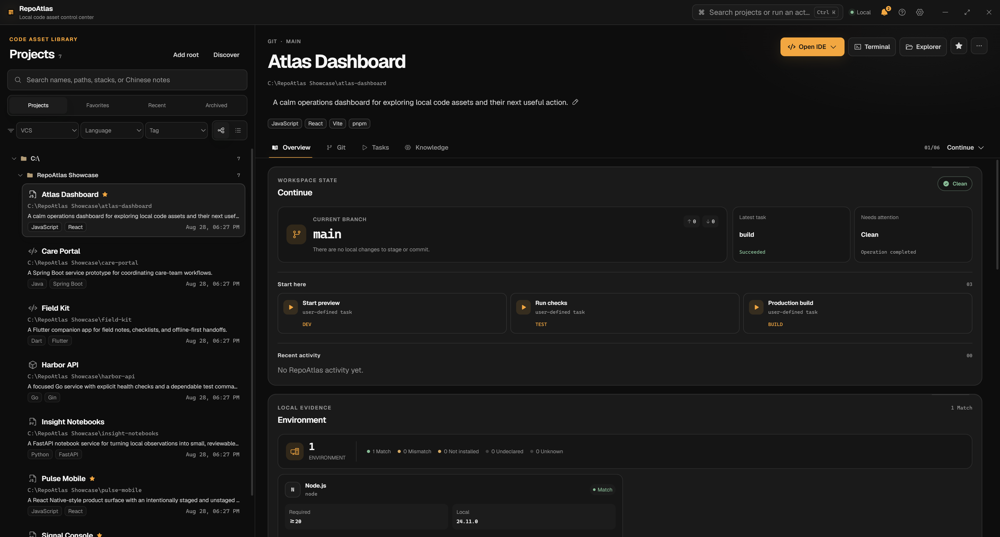
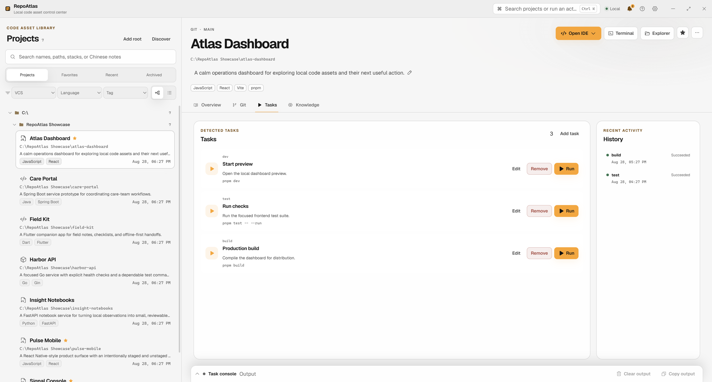

<p align="center">
  
</p>

<h1 align="center">RepoAtlas</h1>

<p align="center">
  <a href="README.zh-CN.md">简体中文</a>
</p>

<p align="center">
  <a href="https://github.com/wujer/RepoAtlas/actions/workflows/ci.yml"></a>
  <a href="LICENSE"></a>
</p>

RepoAtlas gathers the code projects scattered across your drives into one local library. Saved tasks run against them with live output, and every run leaves an exit code and a log. Everything stays on your machine: local SQLite, no account, no sync server.


## The library



You authorize a **Scan Root** — one directory — and scanning only happens there. No disk crawl, no filesystem watchers, no silent symlink walks. Each canonical checkout becomes a **Project**. Multiple checkouts of the same repository are linked through **Repository Lineage**, and a module can be promoted to its own project.

Projects group and sort the way folders do, searchable in English and Chinese, with branch, dirty files, and detected runtimes shown up front.

## Tasks



A **Task Definition** is a program, an argument vector, and a working directory — not a hand-built shell string. It runs in a real PTY, output streams line by line, and each **Task Run** keeps its exit code and full log. Stopping a task terminates the whole process tree. Shell mode exists as a clearly marked, higher-risk option; it is not the default.

## Git, knowledge, and MCP

- **Conservative Git**: status, diffs, history, and fast-forward-only pulls. Destructive checkout and reset are not implemented. SVN is read-only.
- **Project knowledge**: notes, detected facts, and AI summaries stay with the checkout. Writing to AI Memory requires your confirmation.
- **MCP**: agents read project knowledge over stdio, inside the same boundaries. A task request from an agent becomes a time-bounded Pending Approval on your desktop — no approval, no run.

## Boundaries

These rules are enforced in `repoatlas-core`:

- All data lives in local SQLite. No account, no sync server.
- Scanning happens only beneath explicitly authorized Scan Roots, and only when you trigger it.
- Removing a Project or Scan Root deletes a record, never your folders.
- Git operations are typed; pulls are fast-forward only.
- MCP cannot write Git, evaluate shell strings, run arbitrary commands, or delete files.
- You preview the exact list of evidence before AI sees any of it.

## Download (Windows x64 beta)

1. Download the latest installer from [Releases](https://github.com/wujer/RepoAtlas/releases).
2. Verify the SHA-256 checksum against the published `SHA256SUMS`:

   ```powershell
   Get-FileHash .\RepoAtlas_0.1.0_x64-setup.exe -Algorithm SHA256
   ```

3. Run the installer. SmartScreen will show an "unknown publisher" warning — expected for an unsigned build. Choose **More info**, then **Run anyway**.

macOS builds are not available yet. They will be published after testing on real hardware.

## Run from source

You need Node.js 24.11 or later (below 25), pnpm 10.20.0, Rust stable, and the [Tauri 2 prerequisites](https://v2.tauri.app/start/prerequisites/) for your platform.

```sh
pnpm install
pnpm tauri dev
```

On first launch, follow the onboarding dialog. It walks you through connecting an MCP client and calling `register_project`, which authorizes your first Scan Root and adds the project to the library.

## Architecture and development

- `src/` — React 19 and TypeScript desktop UI. `src/lib/api.ts` is the typed Tauri boundary.
- `src-tauri/` — Tauri 2 commands and desktop integration.
- `crates/repoatlas-core/` — the authoritative core: SQLite, scanning, Git, tasks, audit, and AI providers.
- `crates/repoatlas-mcp/` — stdio MCP adapter. It reuses `repoatlas-core` and creates no parallel persistence.

Checks:

```sh
pnpm typecheck
pnpm test -- --run
cargo test -p repoatlas-core
cargo check -p repoatlas
pnpm build
```

See [CONTRIBUTING.md](CONTRIBUTING.md), [CODE_OF_CONDUCT.md](CODE_OF_CONDUCT.md), [SECURITY.md](SECURITY.md), and [docs/releasing.md](docs/releasing.md).

## License

[MIT](LICENSE)
