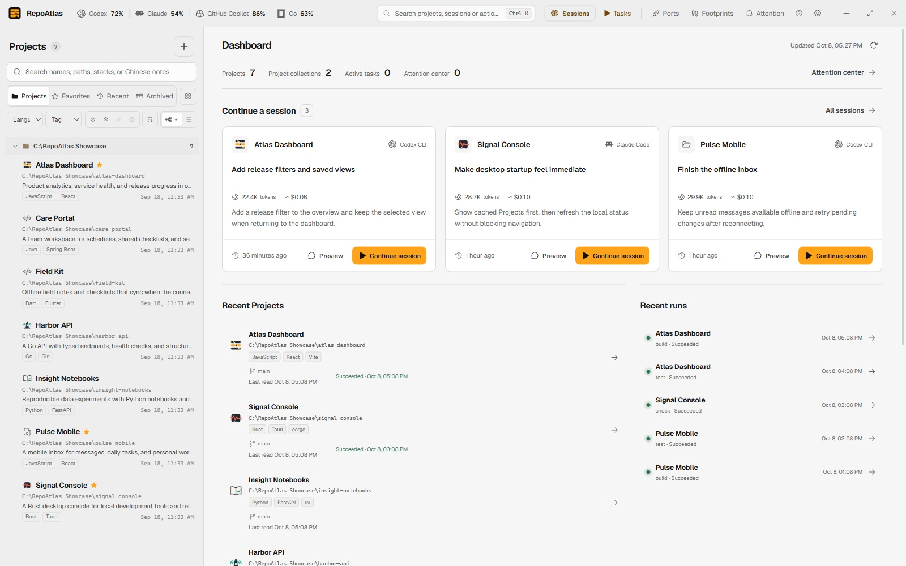
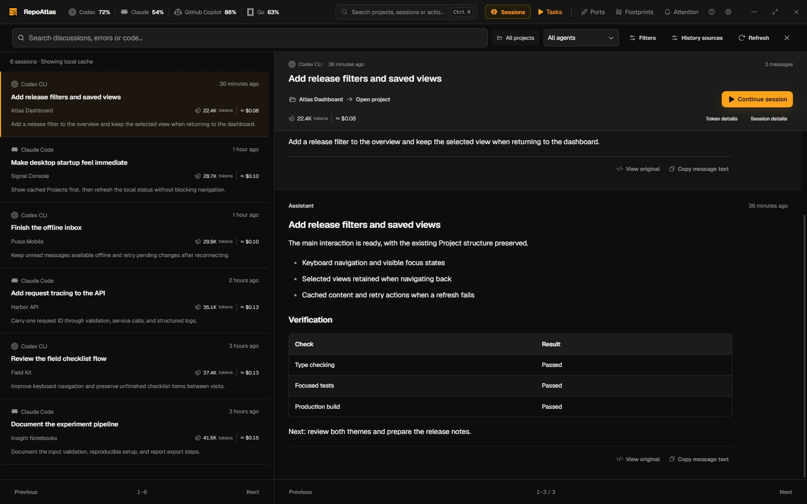
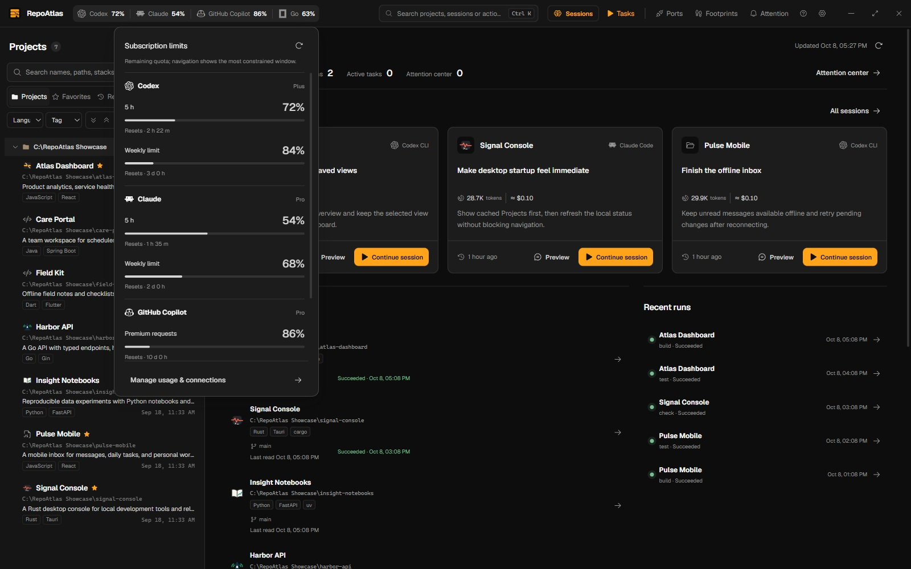
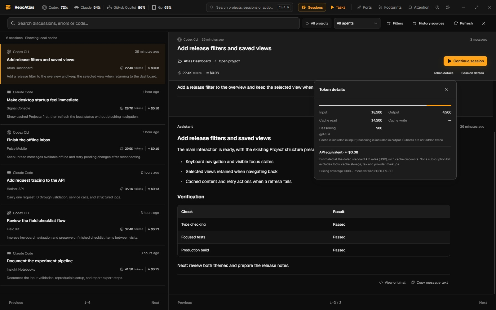
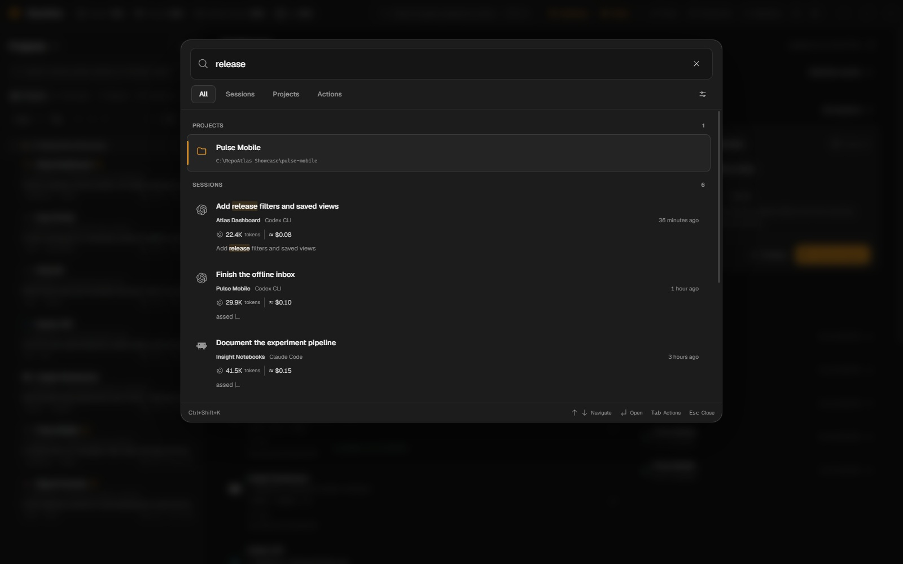
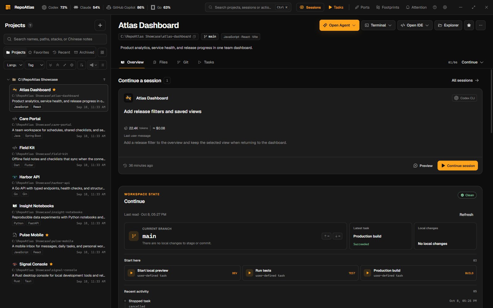
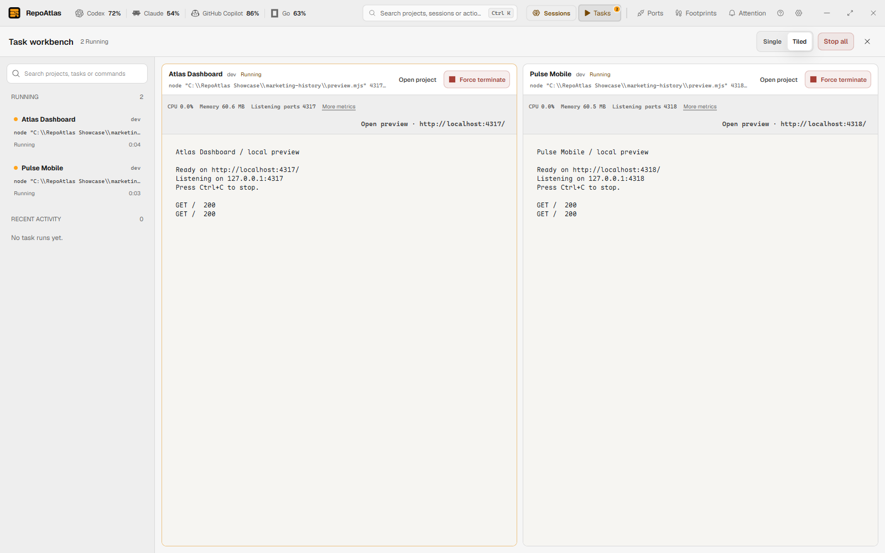

<p align="center">
  
</p>

<h1 align="center">RepoAtlas</h1>

<p align="center">
  <a href="README.zh-CN.md">简体中文</a>
</p>

<p align="center">
  <a href="https://github.com/Wujerry/RepoAtlas/actions/workflows/ci.yml"></a>
  <a href="LICENSE"></a>
</p>

RepoAtlas brings local Projects, coding sessions, and development tasks into one desktop app. Find a checkout, continue a conversation in its original Agent, review Git changes, or run a saved task. Connected Agent quotas stay visible in the title bar; your Project records and task history stay on your machine.

[Download](https://github.com/Wujerry/RepoAtlas/releases) · [Website](https://wujerry.github.io/RepoAtlas/) · [Report an issue](https://github.com/Wujerry/RepoAtlas/issues)

> **macOS contributors wanted.** RepoAtlas has not yet been tested on real Mac hardware, so there is no supported macOS build today. If you have a Mac, help us build, test, and document it through [CONTRIBUTING.md](CONTRIBUTING.md), or open an [issue](https://github.com/Wujerry/RepoAtlas/issues) with reproducible results.

> **0.1.7 downloads:** Windows installers are labeled **UNSIGNED** and do not have an Authenticode signature. macOS packages are experimental, ad-hoc signed and not notarized. SmartScreen or Gatekeeper may show a warning. Updater payloads remain signed; release assets include SHA256SUMS.

<picture>
  <source media="(prefers-color-scheme: dark)" srcset="assets/screenshots/en-dark-workspace.jpg" />
  
</picture>

Desktop screenshots use fictional Projects, conversations, token counts, and subscription quotas. See the [capture guide](docs/demo-showcase.md) for the isolated data and reproducible, cursor-free captures.

## Let your AI Agent do the setup

The fastest first run is not filling in a project catalog by hand:

1. Open RepoAtlas and copy the onboarding instruction to your external AI coding Agent.
2. The Agent connects RepoAtlas MCP, asks which directories it may scan, and registers the approved Projects.
3. Using evidence from each checkout, the Agent adds useful descriptions, reusable Task Definitions, and recognizable Project icons.
4. RepoAtlas refreshes the local library so you can review the result and start working.

For a single open checkout, the Agent can call `register_project`. For a larger archive, the Agent asks for your approval, adds the approved directory as a **Scan Root**, and explicitly calls `scan_root`. Manual registration and scanning remain available in the desktop app.

The Agent keeps ownership of its model, account, provider configuration, conversation, and decisions about reading project files. RepoAtlas keeps the durable Project and task records.

Agent changes to the shared library continue to appear after onboarding, including edits to existing descriptions, tasks, and Collections. The desktop checks local database changes while visible and when you return to it; this does not scan project directories. Task requests expire after 15 minutes and must be requested again if they were not approved in time.

## Main features

- **Pick up where you left off** — restore window size, position and maximized state, the last page and Project, workspace tab, Settings category, list filters and sidebar width after reopening.
- **Home workspace** — open recent Projects, continue coding sessions, review recent runs and handle items that need attention.
- **Sessions** — search authorized history across eight coding Agents, preview messages and resume a selected session in its original Agent.
- **Agent quotas at a glance** — see connected services' remaining quotas in the title bar. Open the readout for usage windows and reset countdowns; choose which services appear in navigation.
- **Agent-assisted initialization** — let an external AI Agent inventory approved directories and write evidence-backed descriptions, tasks, and icons through MCP.
- **Project library** — search Projects in English or Chinese, group related work with Project Collections, and relate multiple checkouts through Repository Lineage.
  Rename Projects from their title without changing directories. Create Collections with searchable membership, selected-only review, and keyboard selection; an empty Collection can be filled later.
- **Project Brief and read-only Files** — inspect detected facts, environment requirements, README, source, configuration, recent activity, and run history without turning RepoAtlas into an editor.
  Environment files appear once with their evidence categories. Open a file in an expandable, syntax-highlighted preview with line numbers, content/path copy, and external-open actions.
- **Saved development tasks** — keep dev, test, build, and packaging commands as reviewed programs plus argument vectors, then run them in a real PTY.
- **Global task workbench** — follow active work across Projects in one full-window surface with up to four live terminals.
- **Runtime visibility** — see process-tree CPU, memory, child processes, listening ports, and safe localhost previews next to the terminal.
- **Conservative Git** — review status, diffs, and history; pull fast-forward only. SVN support remains read-only.
- **Attention and approval** — collect failed runs, unavailable Projects, environment mismatches, and Agent task requests that still need desktop approval.
- **Signed updates** — when a signed update is found, a title-bar entry opens a panel with the release notes and manual check, download, install, and restart actions. Checks are non-blocking and never touch the local library.
- **Local-first records** — Project metadata, task output, exit codes, logs, and audit history stay in local SQLite; no RepoAtlas account or sync server is required.


## Sessions & Continue Coding

Press **Ctrl+K** (Windows) or **Cmd+K** (macOS) to search Projects, session text and
commands together. While RepoAtlas is running, **Ctrl+Shift+K / Cmd+Shift+K** opens
a compact search window from any application. Escape hides that window. Settings
shows shortcut registration failures and provides a retry and an Open search
window action; the in-window shortcut remains available if the global chord is
already taken.

Search a Project name, path, error or feature, then use Up/Down to preview a result.
Session results show the Agent, time, working directory and matching text. Enter
focuses the preview; Tab reaches Copy message text, Open Project, Open full session
and Continue session. Full-session navigation goes to the matching message. Continue
checks the original session and working directory and shows the launch target before
dispatch. Missing histories or directories produce an explanation instead of opening
another conversation. Search reads authorized cached sources; use History sources
to authorize or refresh them. The main desktop must remain running for the global
shortcut.

Use All / Sessions / Projects / Actions to narrow the results. Recent rows stay
compact; previews start at one matching or latest message, with surrounding context
and long text available on demand. Copy remains verbatim even when the preview is shortened.



Find a previous coding conversation across Agents and continue the selected session in its original Agent. Open **Sessions** from the title bar or command palette, or use **Continue session** on the home workspace and Project Overview.

1. **Authorize sources.** Review each absolute history directory, or use **Authorize all** to confirm the listed sources together. Authorization enables local indexing and read-only history access for connected MCP clients.
2. **Search and preview.** Search across Agents, filter by Project, Agent, date or archive status, and read matching messages before launching anything.
3. **Continue the selected session.** Review its command and working directory, then choose CLI or a supported App entry. Project icons identify recent work; clicking a Project title opens that Project.

Built-in history adapters cover **Claude Code, Codex CLI, OpenCode, Cursor CLI, Gemini CLI, GitHub Copilot CLI, Kimi Code, and Qwen Code**. Cursor IDE and Kimi Desktop histories are separate from their CLI histories and are not indexed by these adapters.

History stays local. Refresh shows cached results first and supports cancellation; revoking a source removes its index and excerpts without changing the Agent's original files. Restored backups require source authorization again.

Large Codex image and tool records are streamed without indexing their binary/tool payloads, preserving accompanying text and recorded usage within bounded reading limits. A Project without the optional AGENTS.md shows a neutral empty state.

Resume requires an installed Agent, an available session and a valid working directory. RepoAtlas checks the source and CLI before dispatch, reports errors, and lets you copy the command. Codex App uses a session deep link; App entries without a supported resume interface remain unavailable. The Agent owns login, model access and the actual conversation. Sessions are not migrated between Agents.

Read-only MCP tools: `list_agent_sessions`, `search_agent_sessions`, `get_agent_session`, and `get_agent_session_messages`. They cannot authorize sources or launch a session.

### Token usage and subscription limits



<details>
<summary>View the separate session Token breakdown</summary>



</details>

Connected subscriptions show remaining quota directly in the title bar. Click to
see every window and its reset countdown; **Manage usage & connections** opens
compact account rows, with additional providers under **Add a service**.
Use **Show in navigation** on each connected service in the full Usage page.
The title-bar popover focuses on quotas and reset times; **Manage usage & connections**
opens the visibility settings. Preferences survive restart without changing connections.
All-hidden keeps a compact Usage entry; the full Usage page still lists every account.
Navigation icons play a brief animation when selected, with distinct motion for each feature. System reduced-motion preferences keep them static.

Every enabled navigation entry is shown, with no two-provider cap. When space is
limited, the quota rail scrolls with the wheel/trackpad or left/right arrow keys;
the four work tools and window controls remain directly visible.
There are seventeen connections: **Codex, Claude, GitHub Copilot, OpenCode Go, Kimi Code,
Cursor, Z.ai, GLM Coding Plan, MiniMax Global, MiniMax CN, OpenRouter, DeepSeek,
Grok, Google Antigravity, Factory, Zed and StepFun**.
OpenRouter reports key limits/spend and DeepSeek reports API balance, not subscription
percentages. Enable each connection separately;
authorizing history does not connect an account. No model calls or credential
refreshes are made.

| Connection | Existing credential source |
| --- | --- |
| Codex | `CODEX_HOME/auth.json` (default `~/.codex/auth.json`), ChatGPT login |
| Claude | `CLAUDE_CODE_OAUTH_TOKEN`, or `.credentials.json` in `CLAUDE_CONFIG_DIR` / `~/.claude`; default configuration also supports the native Claude credential store on Windows/macOS |
| GitHub Copilot | `COPILOT_API_TOKEN` or `GITHUB_COPILOT_TOKEN` in RepoAtlas's environment |
| OpenCode Go | The `opencode-go` entry in `$XDG_DATA_HOME/opencode/auth.json` (default `~/.local/share/opencode/auth.json`); Zen keys are separate |
| Kimi Code | `KIMI_CODE_API_KEY`, or OpenCode's `kimi-for-coding` entry |
| Cursor | Read-only `cursorAuth/accessToken` from Cursor's known `User/globalStorage/state.vscdb`, or `CURSOR_SESSION_TOKEN` |
| Z.ai | `ZAI_API_KEY` / `Z_AI_API_KEY`, or OpenCode `zai-coding-plan` / `zai` |
| GLM Coding Plan | `ZHIPU_API_KEY` / `GLM_API_KEY`, or OpenCode `zhipuai-coding-plan` / `zhipuai` |
| MiniMax Global | `MINIMAX_CODING_API_KEY`, or OpenCode `minimax-coding-plan` |
| MiniMax CN | `MINIMAX_CN_CODING_API_KEY`, or OpenCode `minimax-cn-coding-plan` |
| OpenRouter | `OPENROUTER_API_KEY`, or OpenCode `openrouter` |
| DeepSeek | `DEEPSEEK_API_KEY`, or OpenCode `deepseek` |
| Grok | `GROK_BEARER_TOKEN`, or the xAI login in `GROK_HOME/auth.json` (default `~/.grok/auth.json`) |
| Google Antigravity | Existing signed-in Antigravity language server / CSRF-enabled CLI hub; the client must be running |
| Factory | `FACTORY_API_KEY`; current token-limit billing accounts |
| Zed | `ZED_COOKIE` / `TOKEN_MONITOR_ZED_COOKIE`, containing `zed.session` |
| StepFun | `STEPFUN_TOKEN` / `TOKEN_MONITOR_STEPFUN_TOKEN`, raw token or `Oasis-Token` cookie |

Credentials stay in memory and go only to that provider's fixed HTTPS usage endpoint
(Antigravity uses fixed read-only RPCs on the identified client's loopback listener),
never to RepoAtlas storage, IPC or MCP. Renew expired logins in the external tool.
Backups omit connections and quota snapshots. Usage endpoints may change; missing
data and unsupported responses are explicit states. Region-specific credentials
never fall back to another region. Google support observes Antigravity's quota;
standalone Gemini / Google One subscriptions and Qwen account quotas are not queried.
See [usage sources and pricing](docs/usage.md) for adapter scope and limitations.

Session rows, previews and Continue Coding show recorded tokens in K/M/B notation;
expand details for input, output, cache and reasoning counts. Refresh authorized
history once to populate older indexed sessions. Counters are extracted during the
existing incremental refresh and cached in metadata; opening a row never rescans
its transcript. Missing counters appear as unknown, including Cursor CLI and older
formats without token records. Cache input and reasoning subsets are not counted
twice. Known models also show an **API-equivalent USD estimate**, including cache
discounts, with pricing date and coverage in the breakdown. Unknown models remain
unpriced; partial estimates are labeled. This is not the subscription bill.

Usage loads cached metadata first. Provider requests run outside the project lock,
share concurrent refreshes and use a five-minute success cache with retry throttling.
Failures retain timestamped results; elapsed reset times do not invent replenishment.
The persistent title bar refreshes only previously enabled connections, after first
paint and at most every five minutes while visible, with at most three requests
started concurrently per surface. Hidden windows pause scheduling. Core coalesces
requests per provider; account queries never block startup or Project selection.

Sessions keep Project navigation and Continue prominent. Click **Open project** to
select the exact linked Project. Dates/archive filters, source paths and resume
configuration expand on demand; adjacent client context/tool notices form one
collapsed group. Search-hit navigation reveals the exact target inside such groups.

Session history, search previews and surrounding messages share a Markdown reader:
headings, nested lists, task checklists, quotes, tables, safe collapsible details and
double-dollar math. Code blocks have language labels, syntax highlighting, line wrapping
and separate copying. Home/Project cards and search lists retain compact inline formatting.
Known client protocol envelopes are folded; original-view and verbatim copy remain
available. Long messages expand into bounded, navigable sections; code highlighting is
off-thread and starts only for visible blocks. HTML is sanitized and message images are
never loaded automatically. Provider formats were researched in
[Token Monitor](https://github.com/Javis603/token-monitor).

<details>
<summary>See unified Project and session search</summary>



</details>

## Project library



Every canonical checkout is a **Project**. A **Scan Root** is a directory you explicitly authorize for discovery. Scanning is manual, stays under those roots, and never turns into a whole-disk crawler or filesystem watcher.

Project Overview loads saved details without probing Git for missing Repository Lineage. Use Project refresh to update detected remote information. Desktop detail loading, open-activity recording and installed-tool discovery run off the UI thread.

Once selection settles, reopening a recently viewed Project shows its in-memory overview before checking for updated details. Git, environment, documents and installed tools reuse short-lived cached results; expired results update in the background. Project refresh, edits, scanning and external database changes invalidate Project overview caches. Cached content remains visible if a background update fails, with a retry action.

Rapid selections are combined before loading the workspace; only the final selection records a Project open. Switching Projects reads cached session history without restarting indexing, and task-history/log reads run outside the desktop UI thread.

Right-click a folder in the project list and choose **Rescan folder** to refresh that folder within existing Scan Root authorizations. Scanning shows progress and can be cancelled. Folders without an authorized scan area have this action disabled; add a Scan Root in Settings first.

Projects remain tied to their real paths. Collections organize them without moving directories, and removing a RepoAtlas record does not delete the checkout on disk.

RepoAtlas opens on the Dashboard instead of choosing a Project for you. Collections are quick entries into the existing filtered project tree; the snapshot is calculated from bounded local records and does not scan checkouts, refresh Git, read source files, or contact a remote analytics service.

The home workspace puts attention needing action before recent coding sessions, Projects and Task Runs. Empty work areas offer a next step; failed refreshes retain cached content with an explicit warning and retry. Non-Git Projects do not show Git success or sync counts, and unknown Git counts use a dash. Core navigation includes text labels. Consecutive single-child project directories are compacted by default; use Tree view > Show full hierarchy to expand them. Task catalogs with five or fewer definitions reveal advanced filters on demand, and empty history stays compact.

The home workspace brings recent coding sessions, Projects and Task Runs together. Project icons identify each entry; select a Project title to open it, preview a session to read its messages, or use Continue session to review its launch options.

The project tree toolbar adds expand-all, collapse-all, collapse-to-selected, and jump-to-current-project controls so long collections stay navigable without scrolling blind.

## Task workbench

Project tasks initially sort by most recent execution, with unrun tasks last. Switching Projects keeps the active workspace tab, falling back to Overview when that tab is unavailable.

MCP connections can remain active across desktop restarts. Only the desktop owns the runtime lock and recovers interrupted tasks; an idle MCP process does not prevent reopening the app.

Project task history shows task names and recorded commands. Select an entry to open its output and locate the corresponding task card, including tasks hidden by filters. Removed tasks keep their recorded command and output.

Manually ending a running task is shown as **Stopped**, including development servers and interrupted builds. It is separate from successful completion or failure.

Task status follows the process exit code, even when a terminal output stream remains open. Completed tasks leave the running list immediately on the exit event; final log loading does not delay their status update.



A **Task Definition** records the executable, argument vector, and working directory instead of hiding work inside an assembled shell string. Each **Task Run** streams through a real PTY and retains its exit code and full log.

Open the global workbench to follow active runs across Projects. Search its run list by Project, task kind or command without changing the displayed output. A compact toolbar switches between a single terminal and up to four terminals. Current CPU, memory, detected listening ports and safe localhost preview links remain visible; expand More metrics for peak usage and process count. Stopping a task terminates its process tree.

## Download — Windows x64 beta

1. Download the latest installer from [Releases](https://github.com/Wujerry/RepoAtlas/releases).
2. Verify its SHA-256 checksum against the published `SHA256SUMS`:

   ```powershell
   Get-FileHash .\RepoAtlas_0.1.7_x64-setup.exe -Algorithm SHA256
   ```

3. Run the installer. SmartScreen will show an “unknown publisher” warning for the unsigned beta. Choose **More info**, then **Run anyway**.

## Code signing policy

RepoAtlas is preparing to use SignPath Foundation for trusted Windows Authenticode signing. Until that setup is approved and enabled, Windows beta installers may be unsigned and can trigger a SmartScreen warning.

See the [Code signing policy](CODE_SIGNING_POLICY.md) for signing roles, privacy commitments, build-origin requirements, and release verification.

## Run from source

You need Node.js 24.11 or later (below 25), pnpm 10.20.0, Rust stable, and the [Tauri 2 prerequisites](https://v2.tauri.app/start/prerequisites/) for your platform.

```sh
pnpm install
pnpm tauri dev
```

The desktop development command builds and copies the MCP sidecar before starting the app; the first run may take longer.

Each external Agent connection starts its own MCP process. Closing RepoAtlas leaves those connections available; multiple MCP processes can be normal. When a connection closes stdin or a response pipe fails, that MCP process cancels scans, stops queued requests, and exits within five seconds. Clients must close their stdio pipes when disconnecting; an open idle connection remains available.

On first launch, choose **Copy for Agent, scan and discover** in the onboarding dialog. RepoAtlas prepares an instruction that lets your Agent configure MCP, ask for the directories you approve, discover Projects, and populate their descriptions, tasks, and icons.

## Architecture and development

- `src/` — React 19 and TypeScript desktop UI. `src/lib/api.ts` is the typed Tauri boundary.
- `src-tauri/` — Tauri 2 commands and desktop integration.
- `crates/repoatlas-core/` — the authoritative core for SQLite, scanning, safe file inspection, Git, tasks, approvals, and audit.
- `crates/repoatlas-mcp/` — the stdio MCP adapter. It reuses `repoatlas-core` and creates no parallel persistence path.

Checks:

```sh
pnpm typecheck
pnpm test -- --run
cargo test -p repoatlas-core
cargo test -p repoatlas-mcp
cargo check -p repoatlas
pnpm build
```

See [CONTRIBUTING.md](CONTRIBUTING.md), [CODE_OF_CONDUCT.md](CODE_OF_CONDUCT.md), [SECURITY.md](SECURITY.md), and [docs/releasing.md](docs/releasing.md).

## License

[MIT](LICENSE)

### Mixed projects and Modules

Scanning continues below a root `package.json` or checkout. A Project can contain Node, Java and other Modules with their own evidence, runtime requirements and tasks. Module task actions run in the Module directory. Independent nested checkouts remain Projects; other candidates can be explicitly promoted with **Manage as independent Project**. **Use as directory group** retains the root entry and promotes its constituents. These choices survive rescans and never change project files.

The Guide starts with copyable **Initialize MCP** and **Scan directories** prompts. Agents must first obtain confirmed absolute paths, call `add_scan_root`, then `scan_root`. `get_project`, `get_project_brief` and `list_modules` expose cached Module evidence. Use `promote_module` / `set_directory_group` only for a user's explicit management choice. Module task IDs use their parent Project; promoted Modules use their own Project. `run_task` still requires desktop approval.


### Footprints

Open **Footprints** from the title bar to browse a 30-day activity track, search an entire day's records, filter by Project/category, and inspect commits or task runs. Opening first reads the local cache, then updates stale local Git history in the background (last 90 days, current HEAD, no network fetch). Updates show progress and can be canceled. New records appear through an explicit update action so your reading position stays stable. Select a Project and use **Load this history** to collect an older displayed period. Empty repositories and incomplete coverage are reported separately from an empty activity day.

Footprints supports English and Chinese, light and dark themes, and keyboard navigation. Search covers the selected day’s records, including records outside the current page.

Scroll down at the end of a day's records to load the previous day, or scroll up at the top to load the next day (up to today). Page Up/Down also work at list boundaries. The current records remain visible until the adjacent day loads; filters stay applied and empty dates remain selectable. Large days continue paging before moving to the previous day.

### Windows ports and processes

Click the port, process, PID or Project column header to switch between ascending and descending order. Sorting defaults to the lowest listening port, and stays selected through searches, filters and refreshes while the page is open.

Open **Ports & processes** in the top navigation bar (also available in the command palette) to search native TCP listeners by port, PID, process or Project. It includes services launched in terminals and IDEs. Unknown attribution stays unknown; manual associations apply only to the current process instance and desktop session. Stops disclose all affected ports and processes and recheck exact Windows process identity. Managed tasks support a cooperative Ctrl+C request or explicit Job Object termination. For external processes, stop normally in their original terminal/IDE or explicitly force terminate only that process. Port-conflict dialogs can locate owners and recheck through the existing preflight. No automatic termination, elevation, port edits, external restart, WSL or Docker management.

Rows directly show ports, process, PID, the full selectable executable path, managed-task or external-process source, and Project checkout path and attribution evidence. Long paths wrap and unavailable paths are explicitly labeled. Stop restrictions remain visible, and each row offers only its available stop modes.
