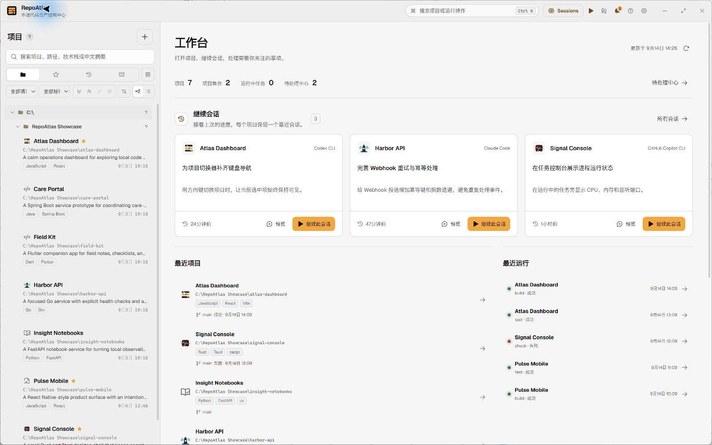
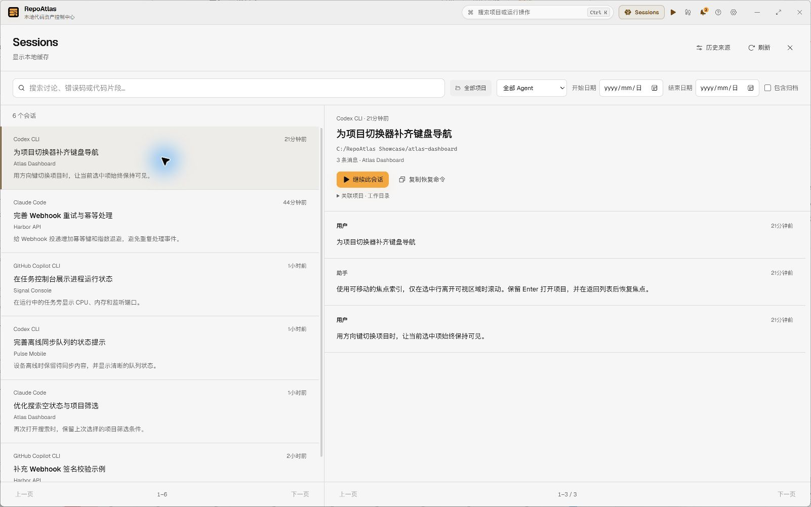
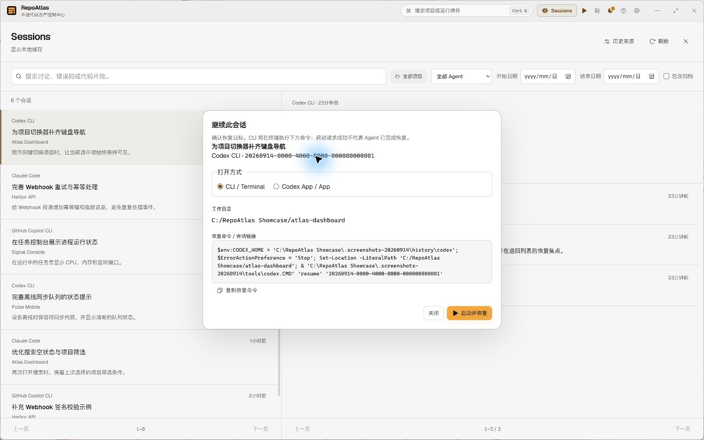

<p align="center">
  
</p>

<h1 align="center">RepoAtlas</h1>

<p align="center">
  <a href="README.md">English</a>
</p>

<p align="center">
  <a href="https://github.com/Wujerry/RepoAtlas/actions/workflows/ci.yml"></a>
  <a href="LICENSE"></a>
</p>

RepoAtlas 把散落在各个磁盘里的本地 checkout 变成一个真正能干活的项目库：看清每个 Project 是做什么的，用合适的编码 Agent 或工具打开它，反复执行开发任务，并把输出和历史留在本机。

> **欢迎 macOS 用户参与贡献。** RepoAtlas 还没有经过 Mac 真机测试，目前不提供受支持的 macOS 安装包。如果你手上有 Mac，欢迎按照 [CONTRIBUTING.md](CONTRIBUTING.md) 帮忙构建、测试和补充文档，也可以把可复现的问题提交到 [Issue](https://github.com/Wujerry/RepoAtlas/issues)。

> **0.1.4 下载说明：** Windows 安装包标注 **UNSIGNED**，未做 Authenticode 签名；macOS 包为实验性构建，仅临时签名，未经公证。系统可能显示 SmartScreen 或 Gatekeeper 提示。更新包仍有签名验证，发布附件提供 SHA256SUMS。

环境文件按路径去重并显示证据类别，支持可展开的语法高亮预览、行号、内容和路径复制，以及外部打开操作。切换项目标签页时，顶部保留最新 Git 分支信息。

足迹列表支持在滚动边缘自动加载相邻日期：向下读完当天记录后进入前一天，向上到顶进入后一天（最晚到今天），也支持 Page Up/Down。加载期间保留当前记录和筛选条件，空白日期不会被跳过。

<picture>
  <source media="(prefers-color-scheme: dark)" srcset="assets/screenshots/zh-dark-workspace.jpg" />
  
</picture>

桌面应用实拍，图中使用虚构演示数据。

## 把初始化工作交给 AI Agent

第一次使用不需要手工填写一套项目档案：

1. 打开 RepoAtlas，把初始化引导中的指令复制给你正在使用的外部 AI 编码 Agent。
2. Agent 连接 RepoAtlas MCP，询问你允许扫描哪些目录，然后登记获得授权的 Project。
3. Agent 根据每个 checkout 里的真实依据，补上有用的项目描述、可重复执行的 Task Definition 和容易识别的项目图标。
4. RepoAtlas 刷新本地项目库，你检查结果后就可以直接开始工作。

只登记当前打开的 checkout 时，Agent 可以调用 `register_project`；整理一批历史项目时，Agent 会先征得你的同意，把获准目录添加为 **Scan Root**，再显式调用 `scan_root`。桌面端也始终保留手动登记和扫描入口。

模型、账号、Provider 配置、对话以及是否读取项目文件由 Agent 自己负责；RepoAtlas 负责长期保存 Project 和任务记录。

初始化结束后，Agent 对已有项目描述、任务和 Collection 的修改也会持续同步到桌面。应用会在可见时和返回窗口时检查本地数据库变化，不会扫描项目目录。任务审批请求在创建 15 分钟后过期，未及时批准的请求需要重新发起。

## 主要功能

- **首页工作台**：集中显示最近会话、项目和任务运行，以及需要关注的事项；点击项目标题即可进入项目。
- **Sessions**：跨八种编码 Agent 搜索已授权历史，预览消息，再回到原 Agent 继续指定会话。
- **Agent 辅助初始化**：让外部 AI Agent 盘点你授权的目录，通过 MCP 写入有依据的项目描述、任务和图标。
- **本地项目库**：中英文搜索 Project，用 Project Collection 整理相关工作，并用 Repository Lineage 关联同一仓库的多个 checkout。
- **Project Brief 和只读 Files**：集中查看技术栈、环境要求、README、源码、配置、最近活动和运行历史，但不把 RepoAtlas 变成代码编辑器。
- **保存开发任务**：把 dev、test、build、打包等操作保存成可检查的程序与参数向量，再放进真实 PTY 运行。
- **全局任务工作台**：在一个全屏工作区里查看跨 Project 的运行中任务，最多同时并排显示 4 个实时终端。
- **运行状态可见**：终端旁直接显示进程树 CPU、内存、子进程、监听端口和安全的 localhost 预览。
- **保守的 Git 操作**：查看状态、差异和历史；拉取仅限 fast-forward。SVN 目前维持只读。
- **待处理与审批**：集中查看运行失败、Project 不可用、环境不匹配，以及仍需桌面批准的 Agent 任务请求。
- **签名更新**：发现新版本时顶栏出现更新入口，面板展示更新日志，并可手动检查、下载、安装和重启。检查是非阻塞的，不影响本地项目库。
- **数据留在本机**：项目资料、任务输出、退出码、日志和审计记录都保存在本地 SQLite，不需要 RepoAtlas 账号或同步服务器。


## Sessions 与继续会话



跨 Agent 找到之前的编码对话，再回到原 Agent 继续指定会话。从标题栏或命令面板打开 **Sessions**，也可以在首页工作台和项目概览使用 **继续会话**。

1. **授权来源。** 逐项确认历史目录的绝对路径，或通过 **全部授权** 一起确认列出的来源。授权后建立本地索引，并允许已连接的 MCP 客户端只读访问这些历史。
2. **搜索并预览。** 默认跨 Agent 搜索，可按项目、Agent、日期和归档状态筛选。先查看匹配消息，再决定恢复哪次对话。
3. **继续指定会话。** 查看命令和工作目录，选择 CLI 或支持恢复的 App 入口。最近会话显示项目图标，点击项目标题即可进入项目。

内置 **Claude Code、Codex CLI、OpenCode、Cursor CLI、Gemini CLI、GitHub Copilot CLI、Kimi Code、Qwen Code** 历史适配器。Cursor IDE 与 Kimi Desktop 的历史独立于 CLI，不在这些适配器的索引范围内。

历史保留在本机。刷新时先显示缓存，支持取消；撤销来源会清理对应索引和摘录，不修改 Agent 原始历史文件。恢复备份后需要重新授权来源。

恢复需要已安装的 Agent、可用会话和有效工作目录。RepoAtlas 在发送启动请求前检查来源与 CLI，显示失败原因，并提供命令复制。Codex App 使用指定会话链接；没有受支持恢复接口的 App 入口保持不可用。账号登录、模型访问和实际对话由 Agent 管理，不做跨 Agent 会话迁移。

只读 MCP 工具：`list_agent_sessions`、`search_agent_sessions`、`get_agent_session`、`get_agent_session_messages`。这些接口不能授权来源或启动会话。

<details>
<summary>查看继续会话的启动选项</summary>



</details>

## 项目库

快速连续选择会合并为最后停留的项目，减少重复加载；切换项目只读取已索引的会话，不会重复启动索引刷新。任务历史和日志读取在后台执行，避免阻塞桌面线程。


每个规范化的本地 checkout 都是一个 **Project**。**Scan Root** 是你明确授权用于发现项目的目录；扫描由你或 Agent 显式触发，只在授权目录内进行，不会变成全盘爬取或文件系统监听。

在项目列表的文件夹上右键，选择“重新扫描”，即可更新该目录中已授权扫描范围内的项目。扫描显示进度并支持取消。没有扫描授权的文件夹会禁用此操作，可先在设置中添加扫描根目录。

Project 始终对应真实路径。Collection 只负责整理，不移动目录；从 RepoAtlas 移除记录，也不会删除磁盘上的 checkout。

RepoAtlas 启动后先显示工作台，不会替你选中某个 Project。最近会话显示项目图标，点击标题进入项目，点击预览阅读对话，通过“继续会话”查看启动选项。项目与任务状态来自本地缓存；已授权的会话来源在后台增量刷新，不扫描项目源码。

## 任务工作台

MCP 连接可以跨桌面重启保持可用。只有桌面持有运行锁并恢复中断任务；空闲的 MCP 进程不会阻止再次打开程序。


一个 **Task Definition** 记录可执行文件、参数向量和工作目录，不把操作藏在临时拼接的 shell 字符串里。每次 **Task Run** 都在真实 PTY 中实时输出，并保留退出码和完整日志。

打开全局任务工作台，可以集中跟踪不同 Project 的运行中任务。每个终端旁都会显示 CPU、内存、进程数、已识别的监听端口，以及可安全打开的 localhost 预览入口。停止任务会终止它的整个进程树。

## 下载——Windows x64 Beta

1. 从 [Releases](https://github.com/Wujerry/RepoAtlas/releases) 下载最新安装包。
2. 校验 SHA-256，并和发布时附带的 `SHA256SUMS` 对比：

   ```powershell
   Get-FileHash .\RepoAtlas_0.1.4_x64-setup.exe -Algorithm SHA256
   ```

3. 运行安装程序。未签名 Beta 会触发 SmartScreen 的「无法识别的发布者」提示；点击 **更多信息**，再点 **仍要运行**。

## 从源码运行

需要 Node.js 24.11 以上（25 以下）、pnpm 10.20.0、Rust stable，以及当前平台的 [Tauri 2 依赖](https://v2.tauri.app/start/prerequisites/)。

```sh
pnpm install
pnpm tauri dev
```

桌面开发命令会先构建并复制 MCP 程序，再启动应用；首次运行可能需要较长时间。

首次启动时，在引导对话框中点击「复制给 Agent，扫描发现」。RepoAtlas 会生成一段指令，让 Agent 配置 MCP、询问你授权的目录、发现 Project，并补齐项目描述、任务和图标。

## 架构和开发

- `src/`：React 19 + TypeScript 桌面界面，`src/lib/api.ts` 是类型化的 Tauri 边界。
- `src-tauri/`：Tauri 2 命令和桌面集成。
- `crates/repoatlas-core/`：SQLite、扫描、安全文件查看、Git、任务、审批和审计的权威核心。
- `crates/repoatlas-mcp/`：stdio MCP 适配器，复用 `repoatlas-core`，不建立平行的持久化路径。

常用检查：

```sh
pnpm typecheck
pnpm test -- --run
cargo test -p repoatlas-core
cargo test -p repoatlas-mcp
cargo check -p repoatlas
pnpm build
```

见 [CONTRIBUTING.md](CONTRIBUTING.md)、[CODE_OF_CONDUCT.md](CODE_OF_CONDUCT.md)、[SECURITY.md](SECURITY.md) 和 [docs/releasing.md](docs/releasing.md)。

## 许可证

[MIT](LICENSE)

### 混合工程与模块

扫描在根目录发现 `package.json` 或 checkout 后仍继续向下发现。一个 Project 可以包含 Node、Java 等不同技术栈的 Module，每个模块都有自己的证据、环境要求和任务工作目录。下层独立 checkout 保持独立 Project；其余模块候选可点击“作为独立项目管理”。“仅作目录分组”保留根目录记录，并将其模块独立管理。这些选择会在再次扫描时保留，不修改工程文件。

说明页最前面提供“初始化 MCP”和“扫描目录”两段可复制提示词。Agent 先获得明确确认的绝对目录，调用 `add_scan_root` 后再调用 `scan_root`。`get_project`、`get_project_brief` 和 `list_modules` 返回缓存的模块证据；只有用户明确要求改变管理方式时才调用 `promote_module` / `set_directory_group`。模块任务使用所属 Project 和模块工作目录，提升后使用独立 Project；`run_task` 仍需要桌面审批。
