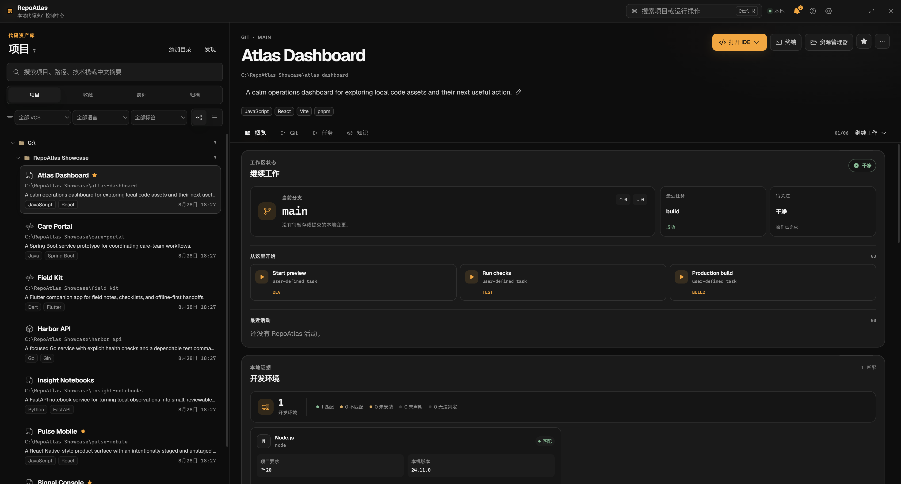
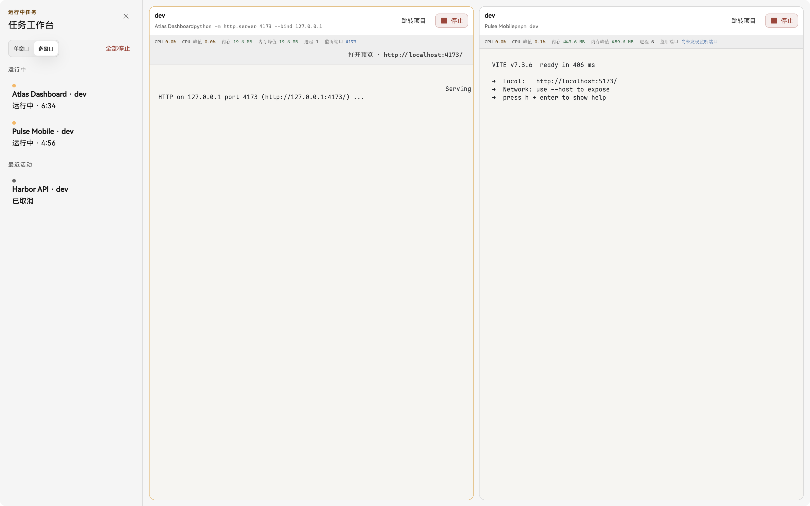

<p align="center">
  
</p>

<h1 align="center">RepoAtlas</h1>

<p align="center">
  <a href="README.md">English</a>
</p>

<p align="center">
  <a href="https://github.com/wujer/RepoAtlas/actions/workflows/ci.yml"></a>
  <a href="LICENSE"></a>
</p>

RepoAtlas 把散落在各个磁盘里的本地 checkout 变成一个真正能干活的项目库：看清每个 Project 是做什么的，用合适的编码 Agent 或工具打开它，反复执行开发任务，并把输出和历史留在本机。

> **欢迎 macOS 用户参与贡献。** RepoAtlas 还没有经过 Mac 真机测试，目前不提供受支持的 macOS 安装包。如果你手上有 Mac，欢迎按照 [CONTRIBUTING.md](CONTRIBUTING.md) 帮忙构建、测试和补充文档，也可以把可复现的问题提交到 [Issue](https://github.com/wujer/RepoAtlas/issues)。

## 把初始化工作交给 AI Agent

第一次使用不需要手工填写一套项目档案：

1. 打开 RepoAtlas，把初始化引导中的指令复制给你正在使用的外部 AI 编码 Agent。
2. Agent 连接 RepoAtlas MCP，询问你允许扫描哪些目录，然后登记获得授权的 Project。
3. Agent 根据每个 checkout 里的真实依据，补上有用的项目描述、可重复执行的 Task Definition 和容易识别的项目图标。
4. RepoAtlas 刷新本地项目库，你检查结果后就可以直接开始工作。

只登记当前打开的 checkout 时，Agent 可以调用 `register_project`；整理一批历史项目时，Agent 会先征得你的同意，把获准目录添加为 **Scan Root**，再显式调用 `scan_root`。桌面端也始终保留手动登记和扫描入口。

模型、账号、Provider 配置、对话以及是否读取项目文件由 Agent 自己负责；RepoAtlas 负责长期保存 Project 和任务记录。

初始化结束后，Agent 对已有项目描述、任务和 Collection 的修改也会持续同步到桌面。应用会在可见时和返回窗口时检查本地数据库变化，不会扫描项目目录。任务审批请求在创建 15 分钟后过期，未及时批准的请求需要重新发起。

## 主要功能

- **工作总览**：启动后先看本地 Project 和 Collection 状态、最近 7 天的 Task Run 结果、最近工作和待处理事项。
- **Agent 辅助初始化**：让外部 AI Agent 盘点你授权的目录，通过 MCP 写入有依据的项目描述、任务和图标。
- **本地项目库**：中英文搜索 Project，用 Project Collection 整理相关工作，并用 Repository Lineage 关联同一仓库的多个 checkout。
- **Project Brief 和只读 Files**：集中查看技术栈、环境要求、README、源码、配置、最近活动和运行历史，但不把 RepoAtlas 变成代码编辑器。
- **保存开发任务**：把 dev、test、build、打包等操作保存成可检查的程序与参数向量，再放进真实 PTY 运行。
- **全局任务工作台**：在一个全屏工作区里查看跨 Project 的运行中任务，最多同时并排显示 4 个实时终端。
- **运行状态可见**：终端旁直接显示进程树 CPU、内存、子进程、监听端口和安全的 localhost 预览。
- **保守的 Git 操作**：查看状态、差异和历史；拉取仅限 fast-forward。SVN 目前维持只读。
- **待处理与审批**：集中查看运行失败、Project 不可用、环境不匹配，以及仍需桌面批准的 Agent 任务请求。
- **数据留在本机**：项目资料、任务输出、退出码、日志和审计记录都保存在本地 SQLite，不需要 RepoAtlas 账号或同步服务器。

## 项目库



每个规范化的本地 checkout 都是一个 **Project**。**Scan Root** 是你明确授权用于发现项目的目录；扫描由你或 Agent 显式触发，只在授权目录内进行，不会变成全盘爬取或文件系统监听。

Project 始终对应真实路径。Collection 只负责整理，不移动目录；从 RepoAtlas 移除记录，也不会删除磁盘上的 checkout。

RepoAtlas 启动后先显示工作总览，不会替你选中某个 Project。点击 Collection 卡片会进入现有的项目树筛选结果；总览只聚合有边界的本地记录，不会触发扫描、刷新 Git、读取源码，也不会连接远程统计服务。

## 任务工作台



一个 **Task Definition** 记录可执行文件、参数向量和工作目录，不把操作藏在临时拼接的 shell 字符串里。每次 **Task Run** 都在真实 PTY 中实时输出，并保留退出码和完整日志。

打开全局任务工作台，可以集中跟踪不同 Project 的运行中任务。每个终端旁都会显示 CPU、内存、进程数、已识别的监听端口，以及可安全打开的 localhost 预览入口。停止任务会终止它的整个进程树。

## 下载——Windows x64 Beta

1. 从 [Releases](https://github.com/wujer/RepoAtlas/releases) 下载最新安装包。
2. 校验 SHA-256，并和发布时附带的 `SHA256SUMS` 对比：

   ```powershell
   Get-FileHash .\RepoAtlas_0.1.0_x64-setup.exe -Algorithm SHA256
   ```

3. 运行安装程序。未签名 Beta 会触发 SmartScreen 的「无法识别的发布者」提示；点击 **更多信息**，再点 **仍要运行**。

## 从源码运行

需要 Node.js 24.11 以上（25 以下）、pnpm 10.20.0、Rust stable，以及当前平台的 [Tauri 2 依赖](https://v2.tauri.app/start/prerequisites/)。

```sh
pnpm install
pnpm tauri dev
```

首次启动时，在引导对话框中点击「复制给 Agent，扫描发现」。RepoAtlas 会生成一段指令，让 Agent 配置 MCP、询问你授权的目录、发现 Project，并补齐项目描述、任务和图标。

## 架构和开发

- `src/`：React 19 + TypeScript 桌面界面，`src/lib/api.ts` 是类型化的 Tauri 边界。
- `src-tauri/`：Tauri 2 命令和桌面集成。
- `crates/repoatlas-core/`：SQLite、扫描、安全文件查看、Git、任务、审批和审计的权威核心。
- `crates/repoatlas-mcp/`：stdio MCP 适配器，复用 `repoatlas-core`，不建立平行的持久化路径。

常用检查：

```sh
pnpm typecheck
pnpm test -- --run
cargo test -p repoatlas-core
cargo test -p repoatlas-mcp
cargo check -p repoatlas
pnpm build
```

见 [CONTRIBUTING.md](CONTRIBUTING.md)、[CODE_OF_CONDUCT.md](CODE_OF_CONDUCT.md)、[SECURITY.md](SECURITY.md) 和 [docs/releasing.md](docs/releasing.md)。

## 许可证

[MIT](LICENSE)
