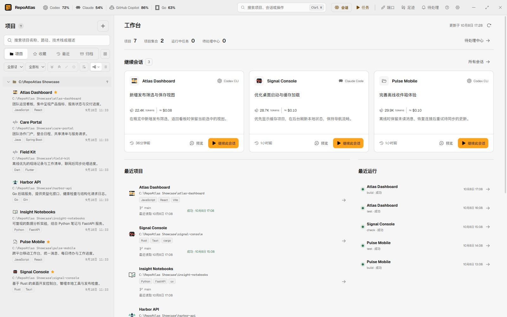
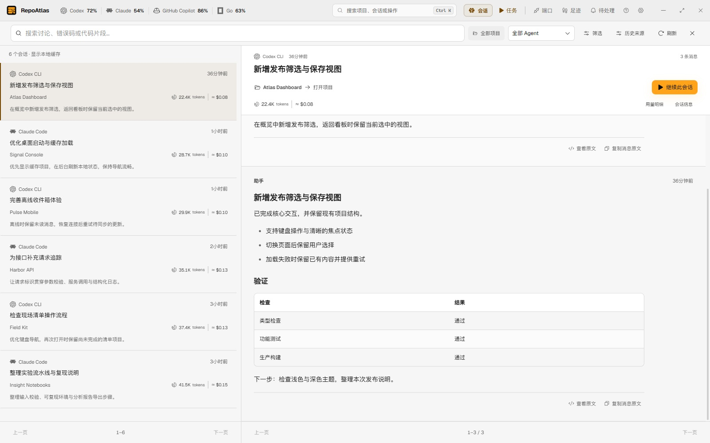
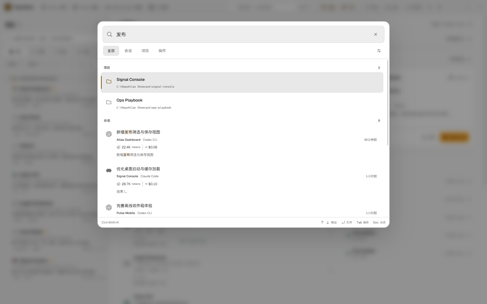
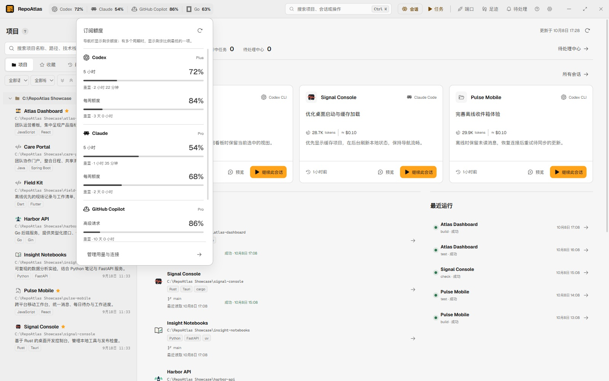
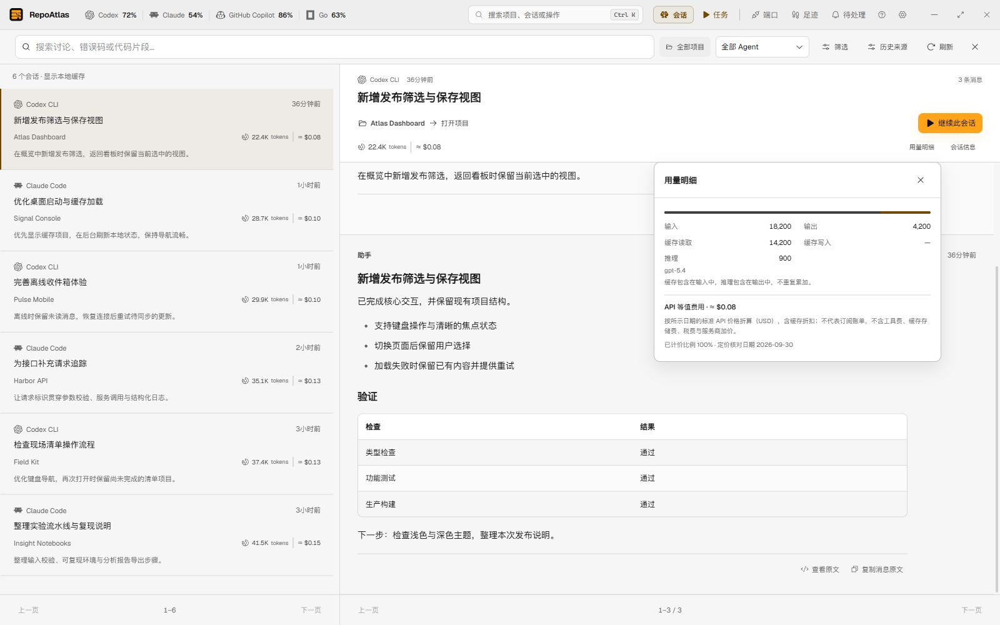
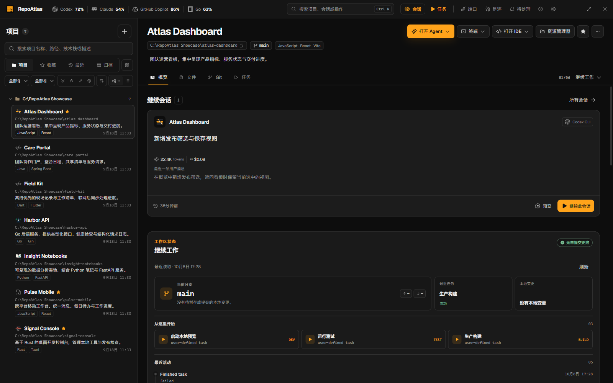
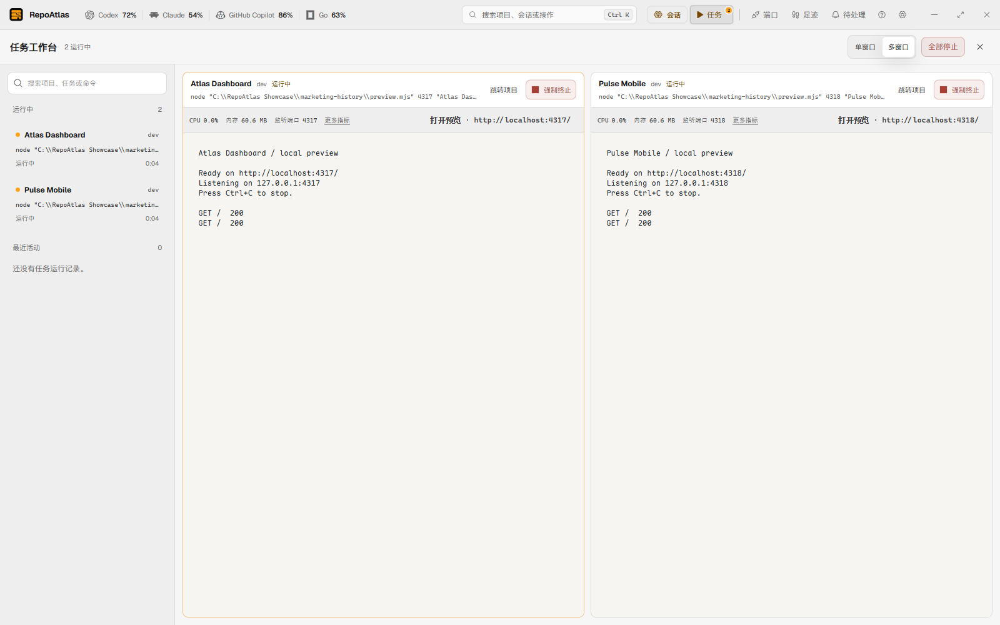

<p align="center">
  
</p>

<h1 align="center">RepoAtlas</h1>

<p align="center">
  <a href="README.md">English</a>
</p>

<p align="center">
  <a href="https://github.com/Wujerry/RepoAtlas/actions/workflows/ci.yml"></a>
  <a href="LICENSE"></a>
</p>

RepoAtlas 把本地项目、编码会话与开发任务放在同一个桌面工具里。找到项目，在原 Agent 中继续上次的会话，查看 Git 改动，或运行保存的开发任务。导航栏直接显示已连接 Agent 的剩余额度，点击即可查看用量周期与重置时间。

项目资料和历史记录保存在本机，无需注册 RepoAtlas 账号，离线也能打开项目库。

[下载安装包](https://github.com/Wujerry/RepoAtlas/releases) · [查看官网](https://wujerry.github.io/RepoAtlas/zh/) · [反馈问题](https://github.com/Wujerry/RepoAtlas/issues)

> **0.1.7 下载说明：** Windows 安装包标注 **UNSIGNED**，未做 Authenticode 签名；macOS 包为实验性构建，仅临时签名，未经公证。系统可能显示 SmartScreen 或 Gatekeeper 提示。更新包有独立的签名验证，发布附件提供 `SHA256SUMS`。
>
> **macOS 尚未经过真机测试。** 目前的实验包不属于正式支持的安装包。欢迎 Mac 用户按 [贡献指南](CONTRIBUTING.md) 帮忙构建、测试和补充文档，或提交可复现的问题。

<picture>
  <source media="(prefers-color-scheme: dark)" srcset="assets/screenshots/zh-dark-workspace.jpg" />
  
</picture>

截图来自桌面应用，项目、会话、Token 计数及订阅额度均为虚构演示数据。数据准备与无鼠标截图方法见[截图指南](docs/demo-showcase.md)。

## 添加第一个项目

可以在桌面端添加单个项目，也可以添加**扫描根目录（Scan Root）**，批量查找该目录下的项目。扫描只在你授权的目录内进行，由你或 Agent 发起，不会扫描整个磁盘或监听文件变化。

如果你正在使用编码 Agent，可以把首次引导中的“复制添加项目的指令”发给它：

1. Agent 连接 RepoAtlas MCP，询问你允许扫描哪些目录。
2. 你确认目录的绝对路径后，Agent 添加扫描根目录并开始扫描。
3. Agent 根据 README、项目清单等文件，填写项目描述、配置开发任务，并设置已有的项目图标。
4. 添加的项目自动显示在桌面端，检查后即可打开工具或运行任务。

只添加当前项目时，Agent 可调用 `register_project`；批量添加时，先调用 `add_scan_root` 授权，再调用 `scan_root` 扫描。连接步骤和可复制的指令也在应用的“说明”页中。

Agent 负责自己的模型、账号、服务商配置和对话，也负责决定是否读取项目文件。RepoAtlas 保存项目与任务记录。Agent 后续修改描述、任务或集合时，桌面端会读取本地数据库变化并更新显示，无需重新扫描项目目录。

## 日常使用

- **查找和整理项目**：按名称、路径、技术栈或描述搜索，用收藏和项目集合整理相关工作。
- **继续上次的工作**：重新打开应用时，恢复窗口大小、位置、最大化状态、上次页面、所选项目、项目标签页、设置分类、列表筛选和侧栏宽度。
- **搜索 Agent 会话**：在已授权的本地历史中查找消息、阅读上下文，再回到原 Agent 继续指定会话。
- **查看项目内容**：在概览中查看技术栈、环境要求和最近活动；在文件页只读预览 README、源码、配置和图片。
- **运行开发任务**：保存启动、测试、构建和打包命令，在任务工作台同时查看最多四个实时终端。
- **查看运行状态**：查看任务的 CPU、内存、子进程和监听端口，从 localhost 地址打开本地开发页面。
- **处理 Git 改动**：查看状态、差异和提交历史，按文件暂存、提交、拉取和推送。拉取仅允许快进合并（fast-forward）；SVN 目前只支持查看。
- **查看用量和工作记录**：在导航栏查看订阅剩余额度，在会话中查看 token 用量，在足迹中按日期回顾操作和提交。
- **处理失败和审批**：集中查看任务失败、项目不可用、环境不匹配，以及需要批准的 Agent 任务请求。

## 搜索并继续会话

在应用内按 **Ctrl+K / Cmd+K** 搜索项目、会话原文和操作。RepoAtlas 运行时，在其他应用中按 **Ctrl+Shift+K / Cmd+Shift+K** 可打开独立搜索窗口。

搜索结果显示匹配的消息、所属项目、Agent 和时间。可用键盘查看前后文、打开项目，或在原 Agent 中继续。标题栏和命令面板中的“会话”可查看完整历史；首页和项目概览也提供最近会话入口。



1. **授权历史目录**：核对目录的绝对路径，逐项授权，或点击“全部授权”一起确认。RepoAtlas 会建立本地搜索索引，已连接的 MCP 客户端也可只读访问这些历史。
2. **搜索并预览**：默认跨 Agent 搜索，可按项目、Agent、日期和归档状态筛选。选中结果后可阅读匹配消息和上下文。
3. **继续会话**：核对启动命令和工作目录，选择 CLI 或支持此会话的桌面应用。也可以复制命令到终端执行。

支持 **Claude Code、Codex CLI、OpenCode、Cursor CLI、Gemini CLI、GitHub Copilot CLI、Kimi Code、Qwen Code** 的本地历史。Cursor IDE 和 Kimi Desktop 的历史独立于 CLI，目前不在索引范围内。

会话正文和搜索预览支持 Markdown 标题、列表、表格、代码块和数学公式。客户端上下文与工具通知默认折叠，仍可查看和复制原文；长消息分段显示，代码高亮按需加载，远程图片不会自动加载。查看“用量明细”或“会话信息”时，正文阅读位置保持不变。

刷新时先显示缓存，读取过程可取消。撤销授权会清理对应的索引和摘录，Agent 原始历史文件会保留；恢复备份后需重新授权历史目录。

继续会话需要已安装的 Agent、可用会话和有效工作目录。启动前会检查来源和 CLI，失败时显示原因并提供可复制的命令。Codex App 使用指定会话链接；暂不支持恢复的桌面应用入口会禁用。账号登录和模型访问由 Agent 管理，RepoAtlas 不提供跨 Agent 会话迁移。

只读 MCP 工具包括 `list_agent_sessions`、`search_agent_sessions`、`get_agent_session` 和 `get_agent_session_messages`，不能通过这些工具授权新来源或启动会话。

<details>
<summary>查看项目与会话统一搜索</summary>



</details>

## 订阅额度与 token 用量



<details>
<summary>查看单次会话的 Token 明细</summary>



</details>

切换顶部功能入口时，图标会播放一次短动画，例如设置齿轮转动、足迹轻踏。开启系统“减少动态效果”后，图标保持静态。

导航栏显示已连接服务的剩余额度。点击后可查看各周期用量、重置时间和缓存状态。在“管理用量与连接”中，可为每个服务设置“显示在导航栏”；隐藏只影响显示，不会断开连接。服务较多时，可用滚轮、触控板或左右方向键横向查看，其他导航入口仍可使用。

目前支持 **17 个用量来源**：Codex、Claude、GitHub Copilot、OpenCode Go、Kimi Code、Cursor、Z.ai、GLM Coding Plan、MiniMax Global、MiniMax CN、OpenRouter、DeepSeek、Grok、Google Antigravity、Factory、Zed 和 StepFun。

OpenRouter 和 DeepSeek 提供 API 额度或余额。Google 额度通过已登录且正在运行的 **Antigravity 客户端**读取，暂不支持 Google One 或独立 Gemini 订阅查询。详细范围见[用量说明](docs/usage.md)。

每个服务需单独连接，授权会话历史不会自动启用账号用量查询。RepoAtlas 使用已有登录凭据，向对应的固定用量接口查询；凭据不会写入数据库、日志或 MCP，也不会代管登录或续期。界面先显示缓存，再按频率限制刷新；查询失败或结果过期时会注明状态。

会话、搜索结果和最近会话卡片以 K/M/B 格式显示已记录的 token 数，明细区分输入、输出、缓存和推理。金额按模型公开 API 定价折算为 **美元等值估算**，仅供了解用量，不代表订阅账单。缺失计数、未知模型和无法计价的部分会单独标明，不会当作零费用。刷新已授权历史可更新旧记录；查看用量时使用缓存，无需重复扫描文件。

## 项目库与项目集合



一个**项目（Project）**对应一份本地代码检出目录，以规范化后的真实路径识别。同一仓库的多个本地副本通过 **Repository Lineage（仓库关联）**联系起来，仍分别管理。

**项目集合（Project Collection）**用于整理相关项目，不会移动目录。新建集合时，可搜索项目、查看已选项，用方向键导航、空格勾选，也可以先创建空集合。点击项目标题旁的编辑按钮可改名，只修改显示名称，磁盘目录名保持不变。

在项目列表的文件夹上右键，选择“重新扫描”，可更新该目录内已有扫描授权的项目。扫描有进度提示，可随时取消。没有授权时，需先添加扫描根目录。移除项目记录或扫描根目录不会删除磁盘上的项目文件。

首次进入或没有可恢复的项目时，应用显示首页工作台；之后重新打开会恢复上次保存的页面和项目选择。首页先显示待处理事项，再列出最近会话、项目和任务记录。点击项目标题打开项目，点击“预览”阅读会话，点击“继续会话”查看启动选项。

项目和任务先显示缓存，刷新失败时保留已有内容，并提供重试入口。切换项目会沿用当前标签页；目标项目不支持该标签页时回到概览。快速连续选择项目时，只加载最后停留的项目，会话部分使用已有索引。

环境文件按路径去重，注明识别依据，支持语法高亮、行号、扩大预览、复制内容或路径，以及用外部工具打开。切换标签页时，顶部保留最近读取的 Git 分支信息。非 Git 项目不显示 Git 状态，未知数量显示为“—”。

项目树默认合并连续的单子目录，可从树形视图菜单切回完整层级。任务默认按最近运行时间倒序排列，未运行的任务放在末尾；任务不超过五个时，筛选选项按需展开。

### 多技术栈项目与模块

扫描在根目录发现 `package.json` 或 Git 项目后，仍会继续检查下层目录。一个项目可包含 Node、Java 等不同技术栈的**模块（Module）**，各自保留识别依据、环境要求和任务工作目录。

下层独立的代码检出目录仍作为独立项目管理。其他模块候选可通过“作为独立项目管理”单独添加；选择“仅作目录分组”会保留根目录记录，并将已发现的模块独立管理。再次扫描会保留这些选择，不修改工程文件；恢复项目模式也不会合并已独立管理的项目。

Agent 可用 `get_project`、`get_project_brief` 和 `list_modules` 查看已缓存的模块信息。只有你明确要求改变管理方式时，才调用 `promote_module` 或 `set_directory_group`。模块任务使用所属项目和模块工作目录；独立管理后使用返回的新项目。

## 任务、端口与工作记录



**任务定义（Task Definition）**保存程序、独立参数和工作目录。每次**任务运行（Task Run）**在交互式终端（PTY）中输出，结束后保留退出码和完整日志。任务工作台可同时查看不同项目的运行情况，终端旁显示 CPU、内存、进程数、监听端口和可打开的 localhost 地址。

Windows 的“端口与进程”入口位于顶部导航栏，也可从命令面板打开。它列出本机 TCP 监听服务，包括从终端或 IDE 启动的服务，可按端口、PID、进程或项目搜索。点击表头切换排序，默认按进程的最小监听端口升序排列；页面打开期间，搜索、筛选和刷新会保留排序方式。

列表直接展示端口、进程、PID、完整程序路径、任务或外部进程标记，以及项目路径和关联依据。长路径自动换行，可选中复制；未能读取路径时会明确说明。受限进程直接显示无法停止的原因，操作栏只提供当前可用的停止方式。

无法确定所属项目时显示“未知”。手动关联仅对当前进程实例和本次 RepoAtlas 会话有效。停止前会列出受影响的进程和端口，并再次核对进程身份：

- RepoAtlas 启动的任务可发送 Ctrl+C 正常停止请求，也可在确认后强制终止整个任务进程树（通过 Windows Job Object）。
- 外部进程需回原终端或 IDE 正常停止；强制终止需单独确认，只终止选中的进程，保留父进程和子进程。
- 正常停止失败时不会自动强制终止。当前不支持 WSL/Docker，也不会自动提权、修改端口或重启外部进程。

任务启动前若发现端口冲突，可从提示中定位占用进程，处理后重新检查。

“足迹”按日期列出操作记录和 Git 提交。向下读完当天记录后进入前一天，向上到顶进入后一天，最晚到今天；也可使用 Page Up/Down。加载时保留当前记录和筛选条件，空白日期不会跳过。

## 数据、审批与更新

项目资料、任务输出、日志和审计记录保存在本机。设置按“外观与交互”“项目与会话”“数据与备份”“应用更新”分组，可导出项目资料与设置，或备份完整数据库。

MCP 可管理 RepoAtlas 中的项目记录和任务定义。通过 `run_task` 发起的运行请求，必须在桌面端批准后才会执行；请求在创建 15 分钟后过期，需重新发起。MCP 不开放 Git 写入、Shell 模式、任意命令执行或磁盘文件删除。

MCP 连接可跨桌面重启继续使用，空闲的 MCP 进程不会阻止再次打开应用。桌面端负责管理任务运行，并在重启后处理被中断的任务记录。

发现新版本时，顶栏会出现更新入口。可以查看更新说明、下载更新、确认安装或稍后处理；更新包会验证签名。检查更新期间可以继续工作，离线也不影响本地项目库。

## 下载与安装

目前主要提供 **Windows x64 Beta**：

1. 从 [Releases](https://github.com/Wujerry/RepoAtlas/releases) 下载安装包。
2. 计算 SHA-256，与该版本附件中的 `SHA256SUMS` 对比：

   ```powershell
   Get-FileHash .\RepoAtlas_0.1.7_x64-setup.exe -Algorithm SHA256
   ```

3. 运行安装程序。未签名的 Beta 可能触发 SmartScreen 提示；核对来源和校验值后，可点击“更多信息”，再选择“仍要运行”。

## 从源码运行

需要 Node.js 24.11 以上（25 以下）、pnpm 10.20.0、Rust stable，以及当前平台的 [Tauri 2 依赖](https://v2.tauri.app/start/prerequisites/)。

```sh
pnpm install
pnpm tauri dev
```

开发命令会先构建并复制 MCP 程序，再启动桌面应用，首次运行可能需要较长时间。

## 架构和开发

- `src/`：React 19 + TypeScript 桌面界面，通过 `src/lib/api.ts` 调用 Tauri。
- `src-tauri/`：Tauri 2 命令和桌面集成。
- `crates/repoatlas-core/`：负责 SQLite、扫描、文件查看、Git、任务、审批和审计的共享核心。
- `crates/repoatlas-mcp/`：stdio MCP 适配器，复用共享核心和数据存储。

常用检查：

```sh
pnpm typecheck
pnpm test -- --run
cargo test -p repoatlas-core
cargo test -p repoatlas-mcp
cargo check -p repoatlas
pnpm build
```

开发约定见 [CONTRIBUTING.md](CONTRIBUTING.md)，另有[行为准则](CODE_OF_CONDUCT.md)、[安全策略](SECURITY.md)和[发布说明](docs/releasing.md)。

## 许可证

[MIT](LICENSE)
